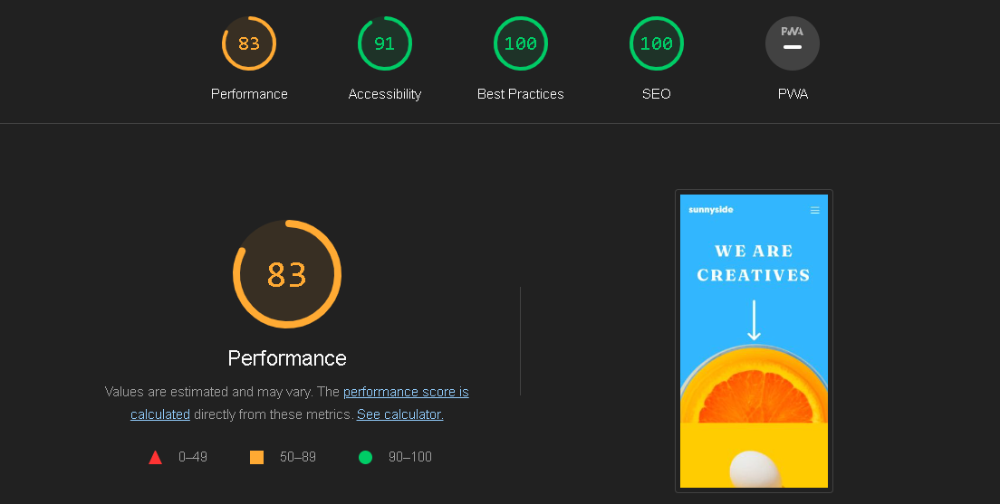

# Sunnyside Agency Landing Page

Welcome to the Sunnyside Agency landing page project! This project is a fun and colorful landing page created using React, Vite, Tailwind CSS, and Framer Motion. It follows the mobile-first approach and is designed to be responsive on various devices including mobile phones, tablets, and desktops.

**Live Demo:** [Sunnyside Agency Landing Page](https://sunnyside-agency-gilt.vercel.app)

## Technologies Used

- React
- Vite
- Tailwind CSS
- Framer Motion

## Features

- Fun and colorful design
- Responsive layout for mobile, tablet, and desktop
- Interactive animations powered by Framer Motion

**Google lighthouse test results** [Sunnyside Agency Google lighthouse test results](https://googlechrome.github.io/lighthouse/viewer/?psiurl=https%3A%2F%2Fsunnyside-agency-gilt.vercel.app%2F&strategy=mobile&category=performance&category=accessibility&category=best-practices&category=seo&category=pwa&utm_source=lh-chrome-ext)
